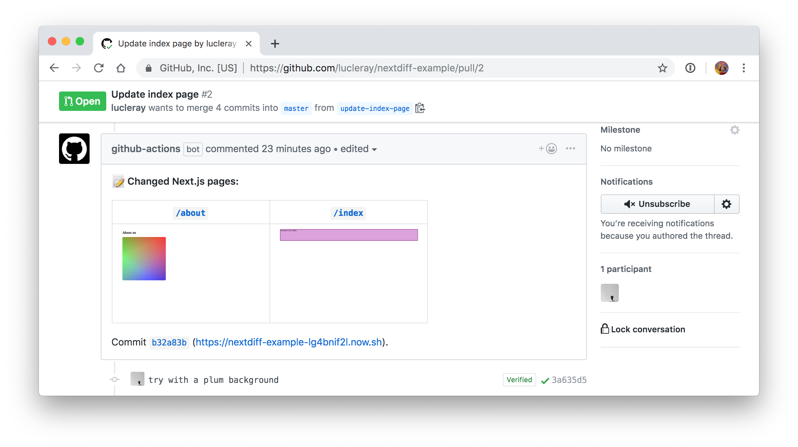

# nextdiff

**Github action for Next.js projects.** Takes a screenshot of your changed pages and writes a comment on the PR.

<div align="center">


<h6>See this PR for real <a href="https://github.com/zeit/nextdiff-example/pull/2">here</a>.</h6>
</div>

## Usage

```h
workflow "diff" {
  resolves = "nextdiff"
  on = "deployment_status"
}

action "nextdiff" {
  uses = "zeit/nextdiff@master"
  secrets = ["GITHUB_TOKEN","ZEIT_TOKEN"]
}
```

In the above code snippet, note that:

- We are using the `deployment_status` event
- `ZEIT_TOKEN` and `GITHUB_TOKEN` need to be added as secrets

This action requires the deployments to be created on the github repository (you can see them in the _environment_ tab in your repository). Many integrations are already doing that for you, for example [ZEIT Now for Github](https://zeit.co/github).

The `ZEIT_TOKEN` is used to upload the screenshot. [Find out how to generate it](https://zeit.co/blog/introducing-api-tokens-management).

## Example

See this repository : [nextdiff-example](https://github.com/zeit/nextdiff-example). And have a look at this [Pull Request](https://github.com/zeit/nextdiff-example/pull/2).

## Arguments

You can use `args` to tweak the behaviour of this github action.

```h
action "nextdiff" {
  uses = "zeit/nextdiff@master"
  secrets = ["GITHUB_TOKEN","ZEIT_TOKEN"]
  args = "--dir app/pages --max 3"
}
```

#### `--dir` (optional)

Use this to specify the folder containing pages. Default is `pages`.

For example, if your Next.js app is located in `/app`, set `--dir app/pages`.

#### `--max` (optional)

Set the maximum number of screenshots to display in the Pull Request comment. Default is `6`.
